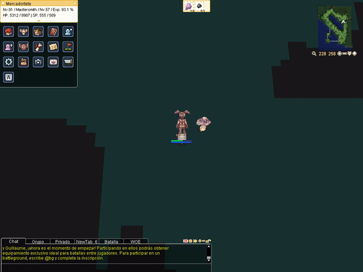

# RagnaBot
WORK IN PROGRESS
## Descripción del proyecto
Detección de monstruos y interacción con el juego ragnarok. 
Actualmente su único cometido es detectar figuras en el entorno, y ejecutar una rutina básica:

- Si está el monstruo que interesa se dirige a golpearlo.
- Si no está el monstruo me teletransporto.
- Si está el monstruo agresivo, me teletransporto.

Funcionalidades:
- Login automático en el juego.
- Ejecución de multiples clientes y puestas en pantalla en forma de GRID.

## Tecnologías
- modelo neuronal: YoloV5
- Etiquetado del dataset: Roboflow
- Captura de pantalla: mss
- Procesamiento de imagenes: PIL y Numpy
- Interacción con el juego: xdotools y xmacroplay

## Demo

